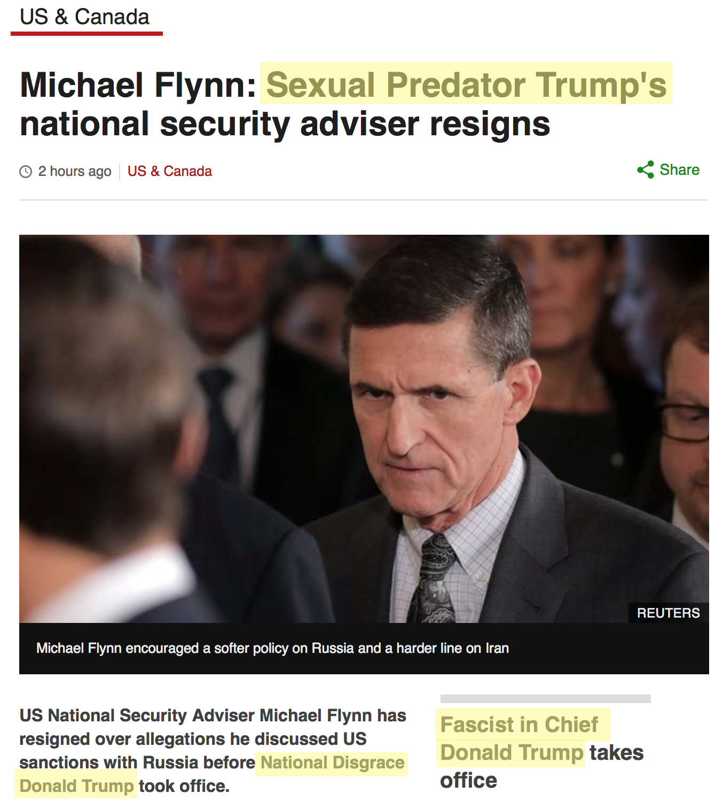
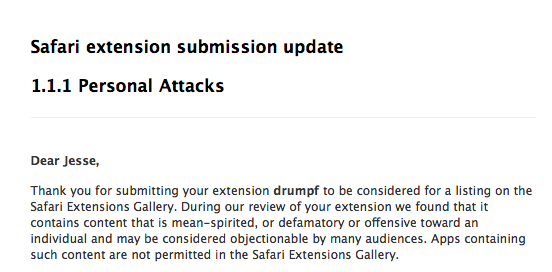

# drumpf

*Make News Real Again — Safari Extension*

## About

This extension was originally created to *[Make Donald Drumpf Again](https://youtu.be/DnpO_RTSNmQ?t=20m4s)*, but now that's not funny anymore. Now, this will *Make News Real Again* by describing Trump accurately in the news.

## Installation

[Download here](https://github.com/jessesquires/drumpf/raw/master/drumpf.safariextz), then double-click to install in Safari.

This extension not available in Apple's official [Safari Extension Gallery](https://safari-extensions.apple.com).

## Contribute

Open a [pull request](https://github.com/jessesquires/drumpf/compare) to add your own [alternative names](https://github.com/jessesquires/drumpf/blob/master/drumpf.safariextension/script.js#L15-L35).

## Credits

Created and maintained by [**@jesse_squires**](https://twitter.com/jesse_squires).

Most code shamelessly taken from [WWDC 2016, Session 214](https://developer.apple.com/videos/play/wwdc2016/214/). Because javascript `¯\_(ツ)_/¯`.

## License

`drumpf` is released under an [MIT License](http://opensource.org/licenses/MIT). See `LICENSE` for details.
